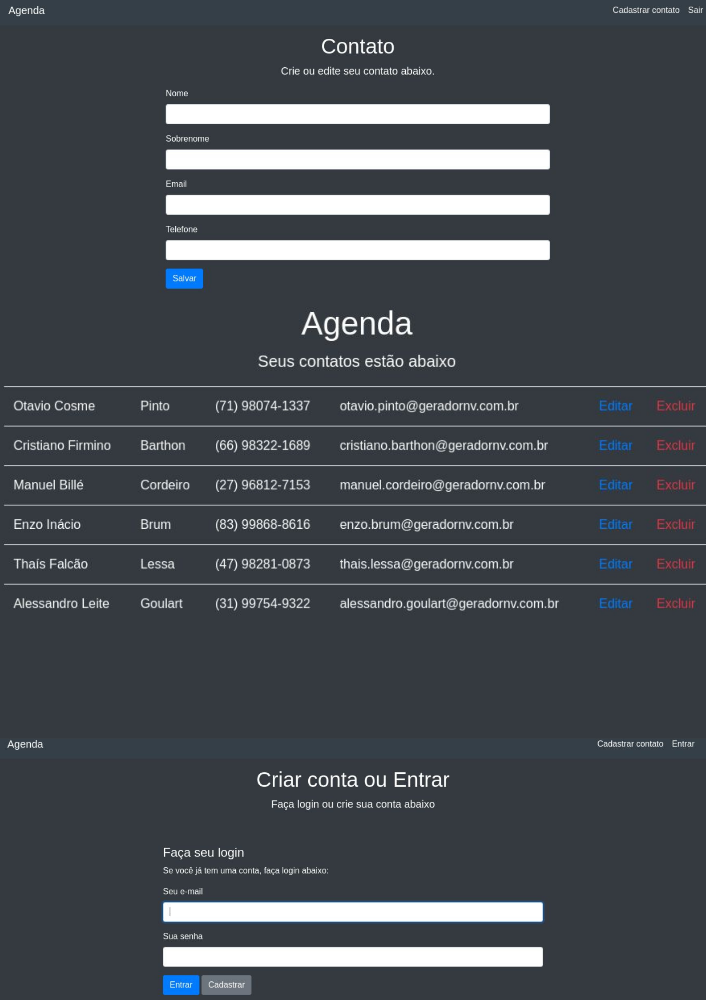

# Projeto de Agenda em JavaScript - Node.js, (Express e MongoDB)

## Descrição

Este é um projeto de agenda desenvolvido em JavaScript e Node.js. Ele utiliza o padrão MVC (Model-View-Controller) e várias outras tecnologias para fornecer uma experiência de usuário eficiente e agradável.

  

## Tecnologias Utilizadas

- **Express**: Framework web rápido, flexível e minimalista para Node.js.
- **Mongoose**: Ferramenta de modelagem de objetos MongoDB projetada para trabalhar em um ambiente assíncrono.
- **MongoDB**: Banco de dados NoSQL, orientado a documentos.
- **EJS**: Linguagem de modelagem para criação de páginas HTML usando JavaScript.
- **Dotenv**: Módulo que carrega variáveis de ambiente de um arquivo .env para process.env.
- **Bootstrap**: Framework de código aberto para desenvolvimento com HTML, CSS e JS.
- **Validator**: Biblioteca de validação de strings.
- **Connect-flash**: Middleware para mensagens flash no Express.
- **Babel**: Compilador JavaScript usado para converter código ES6+ em uma versão compatível com versões anteriores.
- **Webpack**: Empacotador de módulos estáticos para aplicativos JavaScript modernos.

## Instalação

1. Clone o repositório para a sua máquina local usando `https://github.com/jonhvito/agenda_Node.js`.
2. Navegue até o diretório do projeto e execute `npm i` para instalar as dependências.
3. Crie uma conta no <a href="https://account.mongodb.com/account/login">MongoDB</a> e obtenha sua chave de acesso.
4. Crie um arquivo `.env` na raiz do projeto e insira as variáveis de ambiente necessárias.
5. Execute `npm start` para iniciar o servidor.

## Uso

É uma aplicação de uso simples, com uma interface bastante simples, pois o foco do projeto é treinar habilidades de lógica de programação e da parte de backend. Na primeira página, a <a href="#">Agenda</a> é mostrada logo de cara, que tem alguns contatos salvos. Para que o usuário faça qualquer alteração na agenda, é necessário que ele tenha login e senha. Após o usuário se registrar e obter login e senha, ele pode adicionar contatos na <a href="#">Agenda</a>, editar e excluir.

## Contribuição

Pull requests são bem-vindos. Para mudanças importantes, abra um problema primeiro para discutir o que você gostaria de mudar.

## Licença

MIT

  

